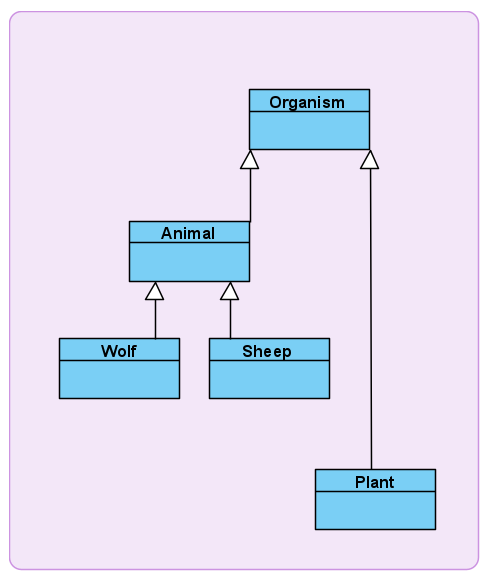

# :seedling: Ecosystem Simulator :seedling:
Ecosystem Simulator is a Java program that models an environment with three species: wolves, sheep, and plants. These organisms interact each other by consuming each other (i.e. wolves eat sheep, sheep eat plants) and by competing against each other (i.e. wolves fight other wolves). Slightly different quantities of each starting species can lead to drastically different population trends.

\
&nbsp;

## Implementation
This program was implemented with Java 12 and Swing. This program leverages OO principles including abstraction, inheritance, and encapsulation. The UML of the organism hierarchy is shown below:

## Sept 2021 Major Refactor
In Sept 2021, I decided to take some time refactoring this project! I kept the core logic of the program the same, with the added accomplishments:

:heavy_check_mark: decomposed monolithic code sections

:heavy_check_mark: greatly reduced code duplication

:heavy_check_mark: unnested complex if-statements, preferring early returns

:heavy_check_mark: applied fun constructs such as generics, enums, switch statements

:heavy_check_mark: formatted all files

### Reflecting Back
There's some changes I would have made if I were to start over:

:+1: preferring composition over inheritance, since this couples the parent and sub classes which decreases flexibility

:+1: focusing on separation of concerns for classes

:+1: improving polymorphism to reduce downcasting and type checking

Granted, I started this project when OOP was still new to me. I'm glad to have come so far to be able to improve on my work. Not only was this a great exercise, it was a good opportunity for self-critique. 
