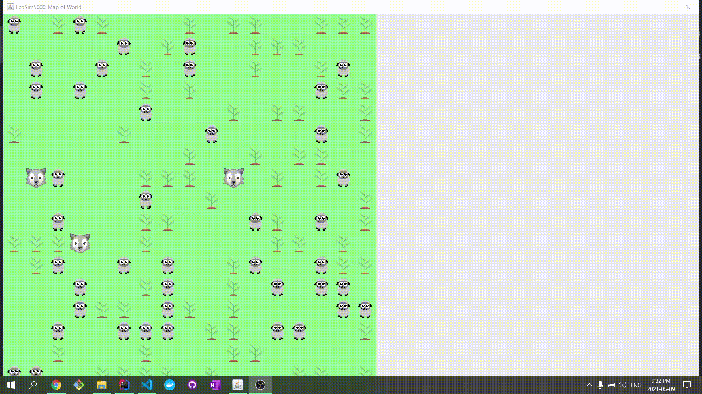

# :seedling: Ecosystem Simulator :seedling:
Ecosystem Simulator is a Java program that models an environment with three species: wolves, sheep, and plants. These organisms interact each other by consuming each other (i.e. wolves eat sheep, sheep eat plants) and by competing against each other (i.e. wolves fight other wolves). Slightly different quantities of each starting species can lead to drastically different population trends.

\
&nbsp;

## Implementation
This program was implemented with Java and Swing. This program leverages OO principles including abstraction, inheritance, and encapsulation.\
&nbsp;
